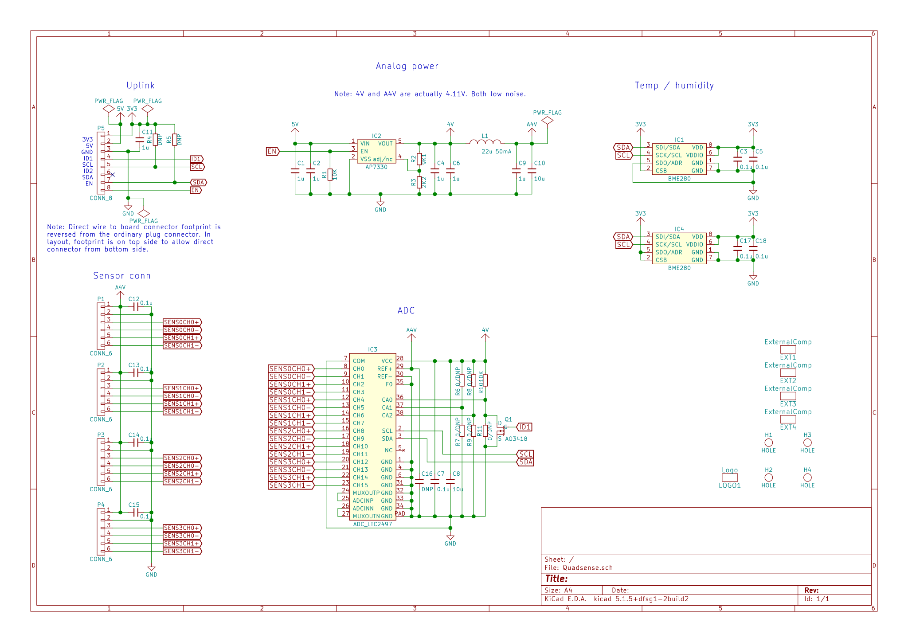
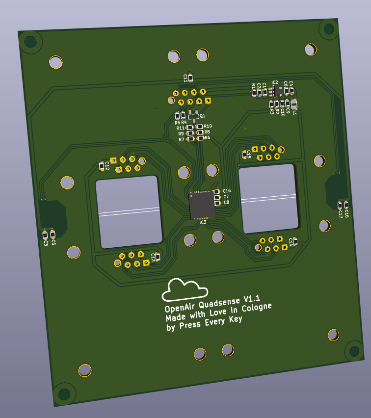

# OpenAir Quadsense Module

This is an extension module for the OpenAir.cgn base board
to connect to Alphasense gas concentration sensors using
Alphasense ISB boards to provide amplifier circuitry.

